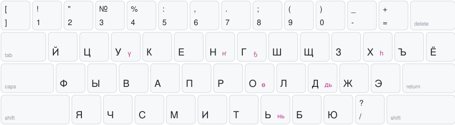

<div align="center">

# ⌨️ Sakha Keyboard for macOS

**Type in Sakha (Yakut) on a Mac — without losing a single Russian or English letter.**

[](https://github.com/carbongo/sakha-keyboard-macos/releases/latest)
[](https://github.com/carbongo/sakha-keyboard-macos/actions/workflows/ci.yml)

[](LICENSE)

**English** · [Русский](README.ru.md)

</div>

Four layouts, one install, no restart:

| Layout | Built on | Where the Sakha letters are |
|---|---|---|
| [**Sakha (Russian)**](#sakha-russian) | Mac Russian | Number row, same as the Windows "Sakha" layout |
| [**Russian (Sakha)**](#russian-sakha) | Mac Russian | **Opt** + the Russian letter that looks like it |
| [**Sakha (Latin)**](#sakha-latin) | US | Common Turkic Latin alphabet |
| [**Sakha (Novgorodov)**](#sakha-novgorodov) | US | 1920s Novgorodov alphabet |

> macOS 27 ships its own *Yakut* layout, which replaces ц, г, ъ, ф and ж. These layouts don't.

## 🚀 Install

### Option 1: Terminal (one line)

```sh
curl -fsSL https://raw.githubusercontent.com/carbongo/sakha-keyboard-macos/main/install.sh | bash
```

It asks which layouts to add to your input menu. Then switch with **Ctrl+Space** or **🌐 Globe**. No logout or restart needed.

<details>
<summary>Options</summary>

```sh
# pick layouts without prompts
curl -fsSL https://raw.githubusercontent.com/carbongo/sakha-keyboard-macos/main/install.sh | bash -s -- -l sakha-russian,sakha-latin

# everything, no questions
curl -fsSL https://raw.githubusercontent.com/carbongo/sakha-keyboard-macos/main/install.sh | bash -s -- -y

# uninstall
curl -fsSL https://raw.githubusercontent.com/carbongo/sakha-keyboard-macos/main/install.sh | bash -s -- -u
```

| Flag | |
|---|---|
| `-l, --layouts` | `sakha-russian`, `russian-sakha`, `sakha-latin`, `sakha-novgorodov` or `all` |
| `-y, --yes` | Don't ask; add every layout |
| `--no-enable` | Only install; add layouts in System Settings yourself |
| `-v, --version` | A specific release, e.g. `v2.0.0` |
| `-u, --uninstall` | Remove everything |

</details>

### Option 2: Download and double-click

1. Download **[Sakha-Keyboard.zip](https://github.com/carbongo/sakha-keyboard-macos/releases/latest/download/Sakha-Keyboard.zip)** and open it.
2. Double-click **Install Sakha Keyboard.command** and tick the layouts you want.

> **"Apple could not verify…"?** The installer isn't notarised. Click **Done**, open **System Settings → Privacy & Security**, click **Open Anyway**, and run it again.

To remove the layouts, double-click **Uninstall Sakha Keyboard.command**.

<details>
<summary>Manual install</summary>

Copy `Sakha.bundle` into `~/Library/Keyboard Layouts`. Log out and back in, then add the layouts in **System Settings → Keyboard → Text Input → Edit → +** (search for *Sakha*).

</details>

## 🗺️ Layouts

The large legend is what a key types on its own (Shift for capitals). The small pink legend is **Opt**, and **Shift+Opt** for the upper one. Blue keys differ from the layout it's built on.

### Sakha (Russian)

The Windows Sakha layout (KBDYAK), on Mac Russian. ё stays on its key, and digits are on **Opt+1…0**.


### Russian (Sakha)

Plain Mac Russian. Hold **Opt** for the Sakha letter that looks like it: г→ҕ, н→ҥ, о→ө, у→ү, х→һ, д→дь, ь→нь.



### Sakha (Latin)

Common Turkic Latin: ҕ ğ · ҥ ñ · ө ö · ү ü · ы ı · ч ç · дь j · нь ń · й y. The letters have their own keys, as on German or Turkish keyboards. **Opt+letter** also works (Opt+o → ö). The punctuation those keys used to type moves to Opt.


### Sakha (Novgorodov)

The 1920s Novgorodov alphabet, typed with the closest IPA letters: ɯ ɣ ɟ ŋ ɲ ø, and c for ч. The diphthong keys type **ie uo yø ɯa**. **Opt+vowel** types a long vowel (aː), and **Opt+consonant** doubles it (tt).


## ❓ FAQ

<details>
<summary><b>Do I really not need to log out?</b></summary>

No logout needed. The installer registers the bundle through macOS's Text Input Sources API, so the layouts appear immediately. Some apps that were already open may pick them up only after a relaunch.

</details>

<details>
<summary><b>Will Cmd+C / Cmd+V still work?</b></summary>

Yes. Cmd and Ctrl shortcuts always use the US QWERTY positions in every layout.

</details>

<details>
<summary><b>Where are the flag icons?</b></summary>

Modern macOS shows a text badge for each layout in the menu bar instead of a flag, so there are none.

</details>

## 🤝 Contributing

New letters, better key positions and bug reports are all welcome. See [CONTRIBUTING.md](CONTRIBUTING.md). The layouts are generated by [`build.py`](build.py), so a change is usually a single line.

## License

[MIT](LICENSE). Originally inspired by [@sandaar/sakha-keylayout-osx](https://github.com/sandaar/sakha-keylayout-osx).
