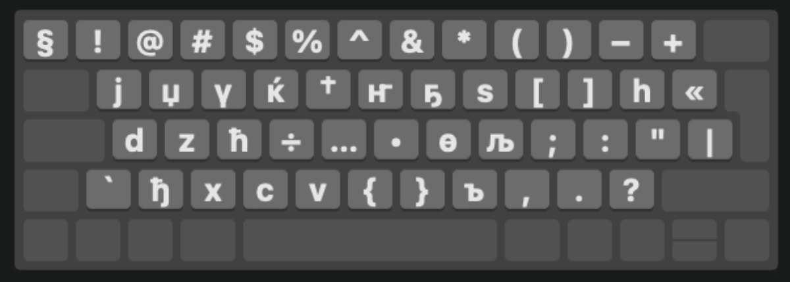
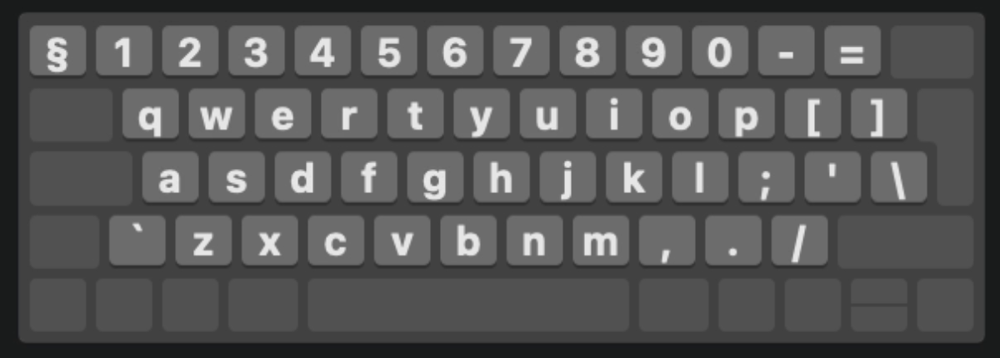
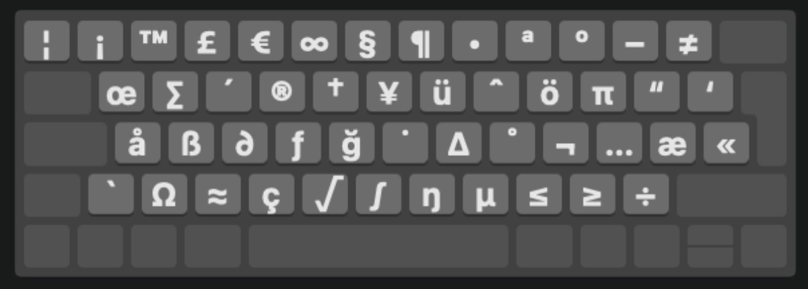

# Sakha (Yakut) Keyboard Layouts for macOS
This is a bundle that contains Unicode Sakha (Yakut) Cyrillic and Latin Keyboard Layouts for a macOS machine. Since there is no Sakha Keyboard Layout on macOS by default, this is intended to fill the gap and provide a better experience than copy&pasting symbols.

Layouts are based on default Russian and English (UK).

## Installation

1. Download the latest version [from releases](https://github.com/carbongo/sakha-keyboard-macos/releases).
2. Open **Terminal**. Go to the downloaded bundle directory. Type in the following:
```
cp -r Sakha\ \(Yakut\).bundle ~/Library/Keyboard\ Layouts/
```
3. Restart your Mac.
4. Open **System Preferences**, and select the **Keyboard preferences**. 
5. In the **Input Sources** tab, enable the **Show input in menu bar**. Press the **[+]** button at the bottom left, and search for *'Yakut'*.
6. Select the desired layout:


You're all set to start using Sakha (Yakut) layout on your Mac.

## Usage
Sakha | Sakha + Option key
:-------------------------|:-------------------------
 | 

Sakha PC | Sakha PC + Option key
:-------------------------|:-------------------------
 | 

Sakha Latin | Sakha Latin + Option key
:-------------------------|:-------------------------
 | 

Sakha Latin PC | Sakha Latin PC + Option key
:-------------------------|:-------------------------
 | 

It's also possible to type uppercase letters by holding down *Shift* at the same time as *Option*.

# Feedback
Suggestions are always welcome. Feel free to send me one by [opening an issue here](https://github.com/carbongo/sakha-keyboard-macos/issues).

#

*Inspired by [@sandaar/sakha-keylayout-osx](https://github.com/sandaar/sakha-keylayout-osx)*