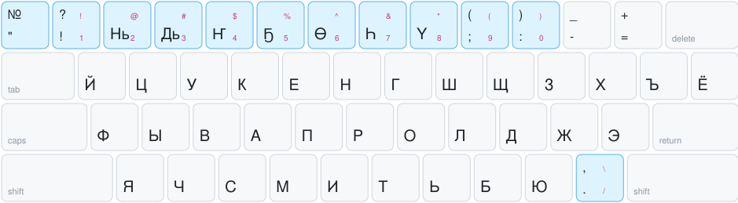
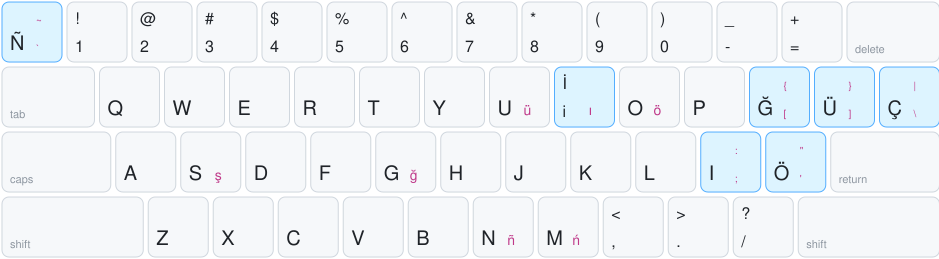
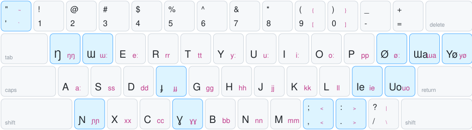

<div align="center">

# ⌨️ Клавиатура саха для macOS

**Печатайте на саха на Mac, не теряя ни одной русской или английской буквы.**

[](https://github.com/carbongo/sakha-keyboard-macos/releases/latest)
[](LICENSE)

[English](README.md) · **Русский** · [Сахалыы](README.sah.md)

</div>

Четыре раскладки, одна установка, без перезагрузки:

| Раскладка | Основа | Где буквы саха |
|---|---|---|
| **Sakha (Windows)** | Русская (Mac) | Цифровой ряд, как в «Саха» для Windows |
| **Sakha (Russian)** | Русская (Mac) | **Opt** + похожая русская буква |
| **Sakha (Latin)** | US | Общетюркская латиница |
| **Sakha (Novgorodov)** | US | Алфавит Новгородова (1920-е) |

> В macOS 27 есть своя раскладка *Yakut*, но она занимает места ц, г, ъ, ф и ж. Эти раскладки ничего не заменяют.

## 🚀 Установка

### Вариант 1: Терминал (рекомендуется, без предупреждений)

```sh
curl -fsSL https://raw.githubusercontent.com/carbongo/sakha-keyboard-macos/main/install.sh | bash
```

Скрипт спросит, какие раскладки добавить; Return — только **Sakha (Windows)**. Переключение: **Ctrl+Пробел** или **🌐 Globe**. Выходить из системы не нужно.

Удаление: `… | bash -s -- -u`. Все параметры: `… | bash -s -- -h`.

### Вариант 2: Скачать и дважды щёлкнуть

> [!WARNING]
> **При первом запуске macOS заблокирует установщик.** Появится сообщение: *«Не удалось проверить, что „Install Sakha Keyboard.command“ не содержит вредоносного ПО»*. Это нормально. macOS показывает его для любого скачанного скрипта, который не нотаризован Apple, а нотаризация требует платного аккаунта разработчика. Установщик — это [`install.sh`](install.sh), его можно прочитать. Чтобы обойтись без предупреждения, используйте [вариант 1](#вариант-1-терминал-рекомендуется-без-предупреждений).

1. Скачайте **[Sakha-Keyboard.zip](https://github.com/carbongo/sakha-keyboard-macos/releases/latest/download/Sakha-Keyboard.zip)** и откройте его.
2. Дважды щёлкните **Install Sakha Keyboard.command**. Появится предупреждение, нажмите «Готово».
3. Откройте «Системные настройки» → «Конфиденциальность и безопасность», прокрутите вниз до сообщения о заблокированном файле и нажмите «Всё равно открыть». Подтвердите паролем или Touch ID.
4. Снова дважды щёлкните **Install Sakha Keyboard.command**, нажмите «Открыть» и отметьте нужные раскладки.

Удаление: **Uninstall Sakha Keyboard.command**. Для него тоже один раз нужен шаг «Всё равно открыть».

> В macOS 15 и новее правый клик → «Открыть» больше не обходит это предупреждение. Используйте «Всё равно открыть» в настройках.

## 🗺️ Раскладки

Крупная подпись — что печатает клавиша сама по себе (с Shift — заглавная). Мелкая розовая подпись — **Opt**, а верхняя из них — **Shift+Opt**. Синие клавиши отличаются от исходной раскладки.

### Sakha (Windows)


### Sakha (Russian)
Opt+г ҕ · Opt+н ҥ · Opt+о ө · Opt+у ү · Opt+х һ · Opt+д дь · Opt+ь нь



### Sakha (Latin)
ҕ ğ · ҥ ñ · ө ö · ү ü · ы ı · ч ç · дь j · нь ń · й y



### Sakha (Novgorodov)
**Opt+гласная** печатает долгую гласную (aː), **Opt+согласная** удваивает её (tt).



## ❓ Вопросы

<details>
<summary><b>В настройках написано «Разработчик сможет получить доступ ко всему, что вы вводите». Вы что-то собираете?</b></summary>

**Нет. Ничего не собирается, не отправляется и не хранится.**

macOS 27 показывает эту надпись для любой раскладки не от Apple, что бы в ней ни было. В этих раскладках нет кода: `Sakha.bundle` — это `Info.plist`, четыре файла `.keylayout` (обычные XML-таблицы вида «эта клавиша печатает ҕ») и четыре значка. Пока вы печатаете, ничего не работает. Установщик запускается один раз, копирует файлы и завершается. Он не остаётся в памяти, после загрузки не выходит в сеть и не собирает телеметрию.

Предупреждение рассчитано на методы ввода — настоящие программы, которые действительно видят нажатия. Apple использует ту же формулировку и для простых раскладок. Все файлы открыты в этом репозитории.

</details>

<details>
<summary><b>Что означают значки в строке меню?</b></summary>

Как у Apple **РУ** и **A**: **СА** — Sakha (Windows), **СР** — Sakha (Russian), **SA** — Sakha (Latin), **NV** — Sakha (Novgorodov). Это значки в рамке, как у Apple; они становятся тёмными или белыми под цвет строки меню и меню. Если всё ещё видны старые флаги, выйдите из системы и войдите снова: macOS обновит свой кэш.

</details>

## 🤝 Участие

Предложения и ошибки присылайте в [Issues](https://github.com/carbongo/sakha-keyboard-macos/issues). Подробности — в [CONTRIBUTING.md](CONTRIBUTING.md).
